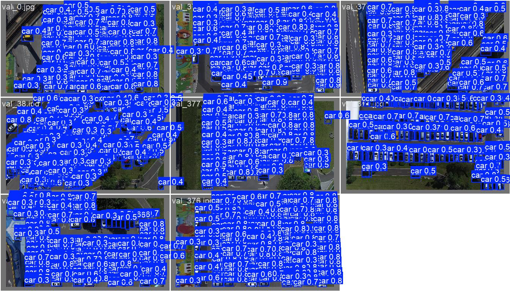
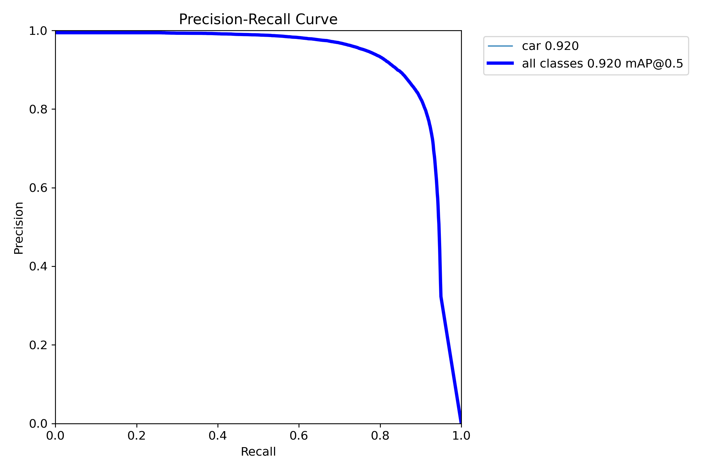
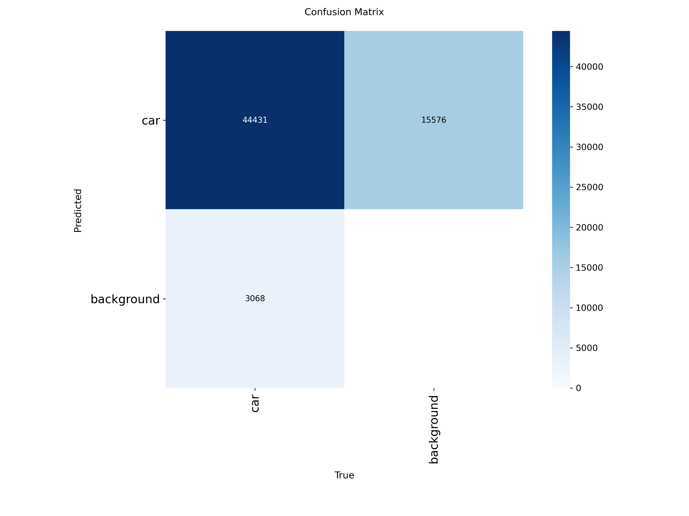

# Sensor-Free Smart Parking with Computer Vision

A computer vision system that detects parking occupancy from aerial imagery — no per-spot sensors required. It uses a YOLOv8 object detector to find vehicles in top-down parking-lot images, then maps detections onto known parking-slot regions to infer which spots are occupied or vacant. It also recommends the **closest vacant spot** to a given entry point, giving the system its "triage" capability.

This was a group project for **SYS 5185** at the University of Ottawa (3-person team).

## Why this is interesting

Traditional smart-parking systems rely on a physical sensor at every space, which is expensive to install and maintain, especially in large outdoor lots. This project shows that object-detection techniques originally developed for unrelated domains (e.g., detecting vehicles/boats in satellite imagery) can be adapted into a scalable, low-cost alternative that covers an entire lot from a single aerial view.

## Results

Trained on a public aerial parking dataset (single `car` class), the YOLOv8 detector reached:

| Metric | Value |
|---|---|
| mAP@0.50 | ≈ 0.92 |
| Precision | ≈ 0.88 |
| Recall | ≈ 0.86 |



**Precision–Recall curve** and **confusion matrix**:




Full training curves are in [`results/results.png`](results/results.png) and raw per-epoch metrics in [`results/results.csv`](results/results.csv).

## How it works

1. **Vehicle detection** — YOLOv8 detects cars in an aerial parking-lot image in a single forward pass.
2. **Occupancy estimation** — Because an *empty* space isn't an object, occupancy is inferred by spatial mapping: each parking slot is a region, and a slot is marked occupied when a detected vehicle's box falls inside it. Occupancy rate = occupied slots / total slots.
3. **Closest-vacancy triage** — Given an entry point, the system returns the nearest vacant slot (Euclidean distance) to guide a driver to an open spot.

## Repository structure

```
.
├── project.ipynb              # Main notebook: training, evaluation, and demo
├── application/
│   ├── export_prediction.py   # Converts model predictions to the visualizer JSON schema
│   └── visualizer_lib.py      # Draws occupied/vacant/entry overlays; closest-vacancy logic
├── parking_yolo/
│   └── data.yaml              # YOLO dataset config (images/labels are gitignored)
├── models/
│   └── best.pt                # Trained YOLOv8 weights
└── results/                   # Curated evaluation plots and metrics
```

## Getting started

```bash
# 1. Install dependencies
pip install -r requirements.txt

# 2. Download the dataset (not stored in this repo)
#    https://huggingface.co/datasets/backseollgi/parking_dataset
#    and arrange it under parking_yolo/ per data.yaml:
#      parking_yolo/images/{train,val}
#      parking_yolo/labels/{train,val}

# 3. Run a prediction with the trained model
yolo detect predict model=models/best.pt source=path/to/aerial_image.jpg
```

Or open `project.ipynb` to reproduce training, evaluation, and the occupancy/triage visualizations end to end.

## Dataset

Aerial parking-lot imagery from the Hugging Face [`backseollgi/parking_dataset`](https://huggingface.co/datasets/backseollgi/parking_dataset) (~1,450 images, single `car` class, with train/val splits). It is **not** included in this repo — download it from the link above.

## Tech stack

Python · Ultralytics YOLOv8 · OpenCV · NumPy · Matplotlib

## Limitations & future work

- Requires predefined parking-slot regions; empty spaces can't be detected directly.
- Sensitive to lighting, occlusion, and perspective distortion.
- Relatively small dataset limits generalization.

Future directions include automatic slot detection via segmentation, larger/more diverse datasets, and hybrid sensor–vision setups for higher reliability.

## Acknowledgements

Built with [Ultralytics YOLOv8](https://docs.ultralytics.com/). Dataset by `backseollgi` on Hugging Face.
